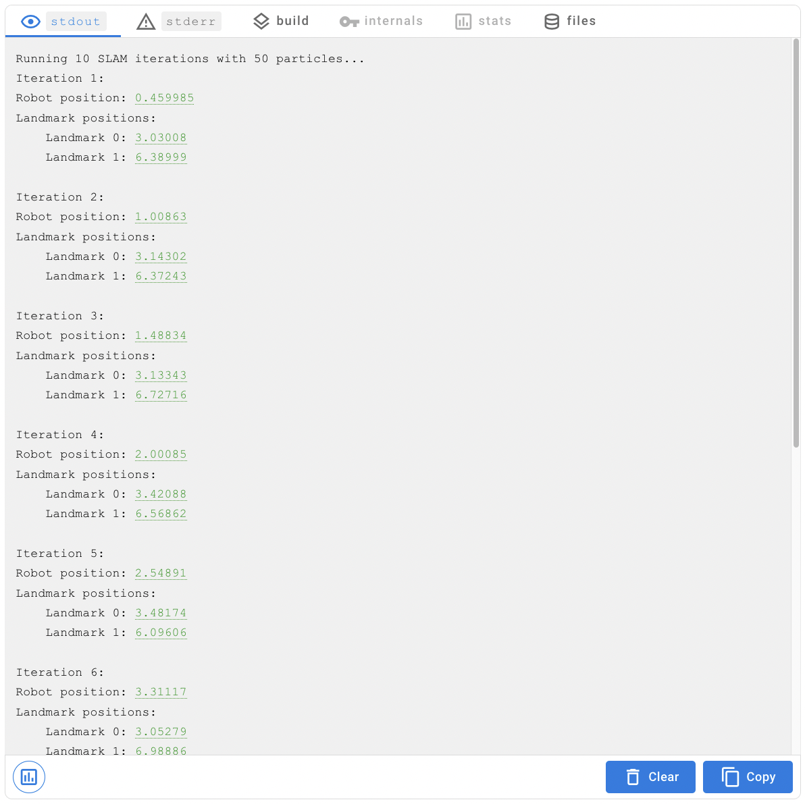
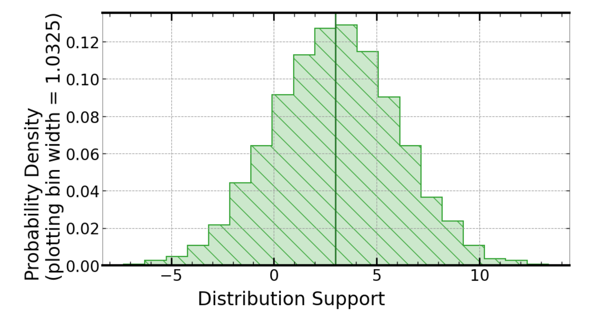
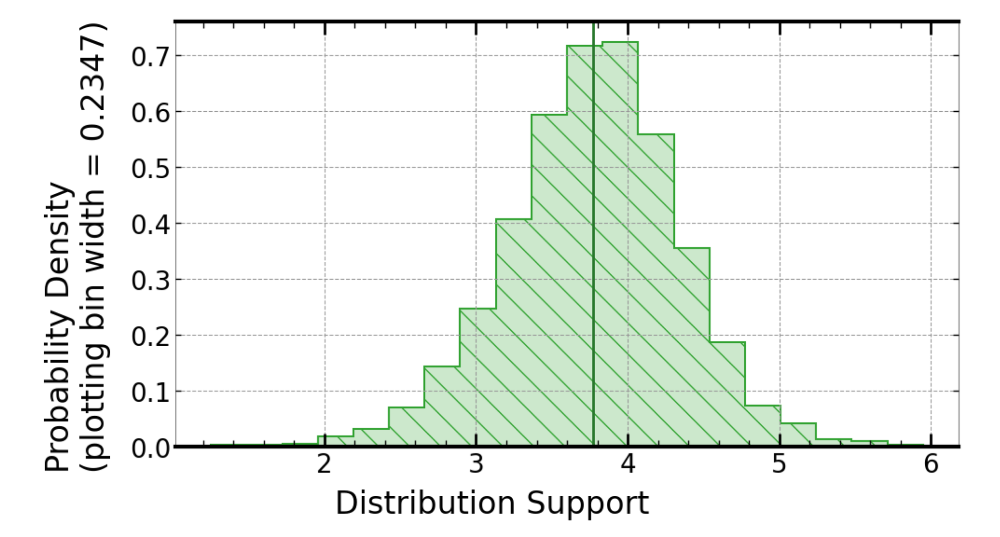
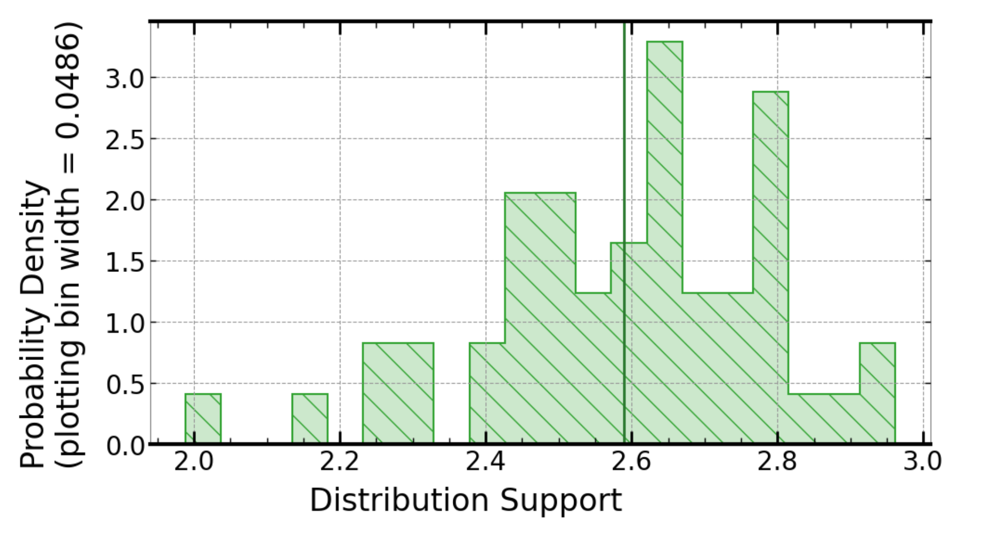

[](https://signaloid.io/repositories?connect=https://github.com/signaloid/Signaloid-Demo-Robotics-SLAM1D#gh-dark-mode-only)
[](https://signaloid.io/repositories?connect=https://github.com/signaloid/Signaloid-Demo-Robotics-SLAM1D#gh-light-mode-only)


# FastSLAM in One Dimension
This is a basic implementation of the FastSLAM[^1] algorithm for a one-dimensional system where a robot moves along a line, observing landmarks along the line. As the robot moves, it measures the distance to each observed landmark — by combining this information with odometry measurements for the robot, the algorithm is able to estimate both the position of the robot and the position of the observed landmarks.

Simultaneous localisation and mapping (SLAM) algorithms are widely used in robotics, for applications ranging from robotic vacuum cleaners to autonomous vehicles and planetary rovers. This example demonstrates how Signaloid's uncertainty-tracking technology can provide hardware acceleration for SLAM algorithm implementations.

**Note:** this example may take a couple of minutes to run on Signaloid's cloud platform. Increasing the number of particles used in the particle filter, as well as the number of measurements in the input data will increase the program run time, but will lead to a more accurate result.

## Input Data
This application reads an input CSV file containing time series measurement data taken as the robot moves along a line. An example input file is provided in `inputs/input.csv`; the expected file format is as follows:
- The first column contains measurements of the robot's speed (for example, rotary encoder measurements taken from a robot's wheels). These measurements are integrated over time to provide odometry information for the SLAM algorithm.
- Subsequent columns contain landmark observation measurements — as the robot moves along, it observes recognisable landmarks and measures the distance to each landmark. Each column in the CSV represents a different landmark: in the example input file, two landmarks are observed. Note that the robot does not need to be able to see every landmark at every timestep — in a real-world implementation, a robot would likely only ever see a fraction of its known map at any one time.

```
input.csv

speed,             landmark0,            landmark1
4.327820336124657, 2.5739581538024217,   5.931091282932724
5.762330904026573, 2.240460904977238,    5.355224128382881
4.557238728823433, 1.7237863555172737,   5.4721891972177
4.972005886897147, 1.7088878960606566,   4.69086735133098
5.554982753097226, 1.2575743469983764,   3.319529798494023
6.979547174604917, -0.24247892131923932, 4.064685710984609
4.560315380306148, 0.22070481556138727,  2.473891569688078
4.219184725156207, -0.7308278896119441,  2.3205760736493195
5.021689826783738, -0.5866460749822314,  1.251318875445348
4.751751351721766, -1.290139319979353,   2.4718343876095243
```
Note that the application ignores the first row in the CSV file, as it is assumed to contain headings for each column (these are not used in the application).

## Command Line Options
The executable can be configured with the following options:
- `-i file` sets the path to the input data file. *(Default value: `input.csv`)*
- `-t timestep` specifies the time delay between successive measurements in the input data. *(Default value: `0.1`)*
- `-n number of particles` specifies the number of particles to use in the fastSLAM particle filter. *(Default value: `50`)*
- `-d odometry standard deviation` sets the standard deviation of the measurement uncertainty distribution for robot speed measurements. *(Default value: `1.0`)*
- `-b observation standard deviation` sets the standard deviation of the measurement uncertainty distribution for landmark observation measurements. *(Default value: `3.0`)*
- `-h` displays the help message for the program.

If no command line arguments are supplied, the default values shown above will be used.

## Program Output
As each measurement (row in the CSV file) is processed by the SLAM algorithm, the application prints out its latest estimate for the system state i.e. position estimates for the robot and for the observed landmarks.



After each iteration, you should be able to see that the variance in the uncertainty of each landmark position estimate decreases: as the robot moves through its environment and gathers more information about its surroundings, a more accurate map of these surroundings can be made.

For example, when running the application with the default input parameters, the uncertainty in the estimate for the position of Landmark 0 looks like this after one measurement is processed:



<br>

By the time the 10th measurement has been processed, the distribution looks like this:



<br>

Note that, as mentioned above, the accuracy of the uncertainty distribution for the robot's position depends on the number of particles used in the particle filter. This is because this distribution is formed directly from the array of `n` particle values.

By default, the distribution will look something like this:



The accuracy can be improved by increasing the number of particles used in the particle filter, however this will increase the time taken for the program to run.

## Repository Tree Structure
```
.
├── README.md
├── inputs
│   └── input.csv
└── src
    ├── fastSLAM.cpp
    ├── fastSLAM.hpp
    ├── main.cpp
    ├── userInput.cpp
    └── userInput.hpp
```

[^1]:
    Montemerlo, Michael & Thrun, Sebastian & Koller, Daphne & Wegbreit, Ben. (2002). FastSLAM: A Factored Solution to the Simultaneous Localization and Mapping Problem. Proceedings of the National Conference on Artificial Intelligence.
